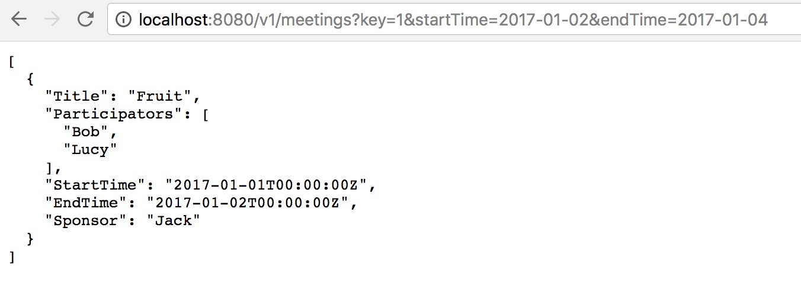

# Microservice-Agenda

[](https://travis-ci.org/smallGum/microservice-agenda)

In this project, we implement both command-line agenda program and web service agenda program. we build our project as a docker image and push it to docker hub.

## Build

For docker hub information, see [microservice-agenda on docker hub](https://hub.docker.com/r/gumcheng/microservice-agenda/)

```shell
# pull microservice-agenda image
$ docker pull gumcheng/microservice-agenda

Using default tag: latest
latest: Pulling from gumcheng/microservice-agenda
aa18ad1a0d33: Pull complete
15a33158a136: Pull complete
f67323742a64: Pull complete
1b4531640cb0: Pull complete
3e7f1f935f2c: Pull complete
a4db2a724d81: Pull complete
9a798ef77d30: Pull complete
2eb0db2e75b6: Pull complete
9f5dcecaa851: Pull complete
62287a31bfe0: Pull complete
Digest: sha256:06cacf43a4f6ee6a4b0faf7a0cd017e16fa6f6056140f428f4d685726d2dfe69
Status: Downloaded newer image for gumcheng/microservice-agenda:latest
```

## Run

start server and run agenda server:

```shell
$ docker run -p 8080:8080 --name agenda -v /data -d gumcheng/microservice-agenda service
```

run agenda client:

```shell
$ docker run -it --rm --net host -v /data gumcheng/microservice-agenda cli
```

## Usage

### agenda server usage

#### user

Register:

```shell
$ curl -d "username=Jack&password=123456" http://localhost:8080/v1/newusers

{
  "UserName": "Jack",
  "Password": "123456",
  "Email": "",
  "Tel": "",
  "Meetings": null
}
```

Login:

```shell
$ curl -d "username=Jack&password=123456" http://localhost:8080/v1/login

{
  "UserName": "Jack",
  "Password": "123456",
  "Email": "",
  "Tel": "",
  "Meetings": null
}
```

Get user key:

```shell
$ curl -d "username=Jack&password=123456" http://localhost:8080/v1/users/getkey

{
  "Key": 1,
  "UserName": "Jack"
}
```

Get user by id:

```shell
$ curl -d "id=1" http://localhost:8080/v1/users

{
  "UserName": "Jack",
  "Password": "123456",
  "Email": "",
  "Tel": "",
  "Meetings": null
}
```

List all users:

```shell
$ curl http://localhost:8080/v1/allusers?key=1

[
  {
    "UserName": "Jack",
    "Password": "123456",
    "Email": "",
    "Tel": "",
    "Meetings": null
  },
  {
    "UserName": "Lucy",
    "Password": "123456",
    "Email": "",
    "Tel": "",
    "Meetings": null
  },
  {
    "UserName": "Bob",
    "Password": "123456",
    "Email": "",
    "Tel": "",
    "Meetings": null
  }
]
```

#### meeting

Create a new meeting:

```shell
$ curl -d "title=Fruit&participators=Bob&participators=Lucy&startTime=2017-01-01&endTime=2017-01-02" http://localhost:8080/v1/meetings?key=1

{
  "Title": "Fruit",
  "Participators": [
    "Bob",
    "Lucy"
  ],
  "StartTime": "2017-01-01T00:00:00Z",
  "EndTime": "2017-01-02T00:00:00Z",
  "Sponsor": "Jack"
}
```

Query a meeting:



Clear meetings:

```shell
$ curl -X DELETE http://localhost:8080/v1/meetings?key=1

{
  "ErrorIndo": "success!"
}
```

After Clearing:


### agenda client usage

```shell
$ ./cli
CLI-agenda is cooperative program for meeting management using cobra package.
        It supports commands such as register, login, creatingMeeting, clearMeetings and so on.

Usage:
  CLI-agenda [command]

Available Commands:
  cancelMeeting cancel meetings you sponsored with specified title
  cancelUser    remove an account from users
  clearMeetings clear all meetings with you as sponsor
  createMeeting Create a new meeting
  help          Help about any command
  login         for guest to login
  logout        logout
  queryMeetings Query meetings of current login user between specific time interval
  quitMeeting   quit from all meetings with you as participator
  register      to register a new user
  setEmail      set registered user's email
  setTel        set registered user's telephone number
  users         list all users

Flags:
      --config string   config file (default is $HOME/.CLI-agenda.yaml)
  -h, --help            help for CLI-agenda
  -t, --toggle          Help message for toggle

Use "CLI-agenda [command] --help" for more information about a command.
```

All functions test are like [CLI-agenda](https://github.com/smallGum/CLI-agenda/blob/master/README.md), thus we do not list here again.
